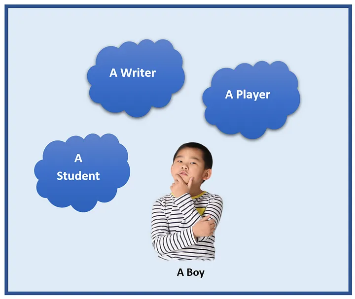
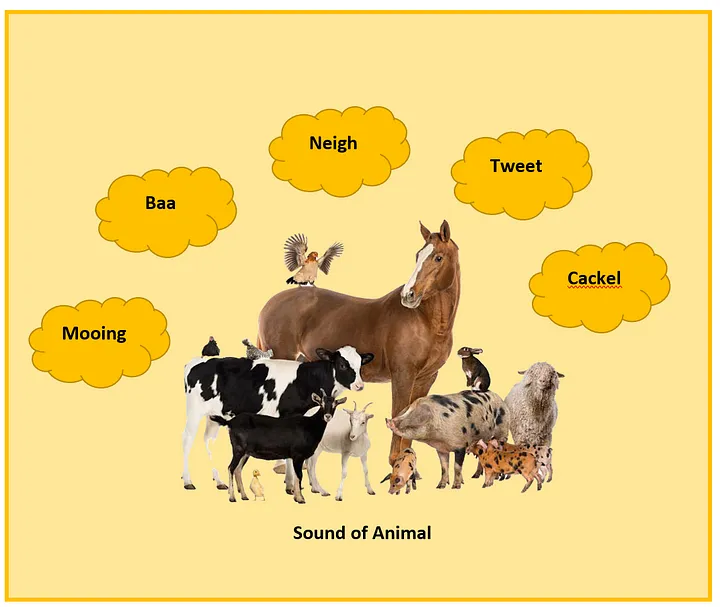
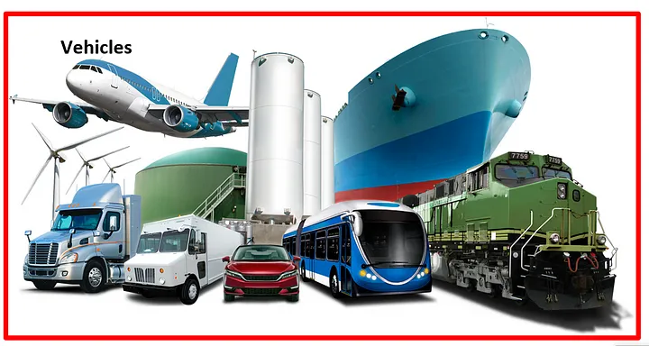
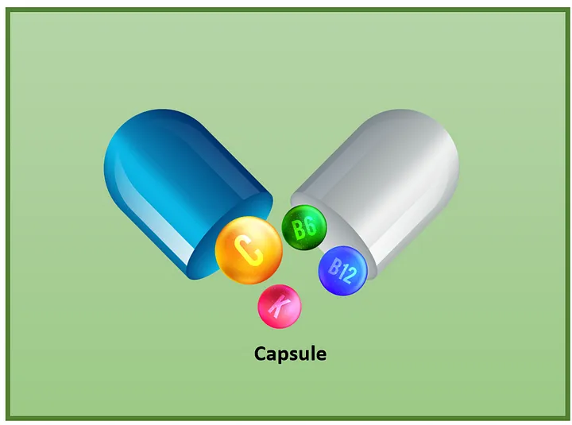

# OOP Concepts with Real-World Examples

This document explains the fundamental concepts of Object-Oriented Programming (OOP) with real-world examples.

## What is OOP?

Object-Oriented Programming (OOP) is a programming paradigm based on objects, which are real-world entities like books, vehicles, trees, etc.

### OOP Concepts

There are four main OOP concepts:

1. **Polymorphism**
2. **Inheritance**
3. **Encapsulation**
4. **Abstraction**

Each of these concepts is explained below with examples.

---

## 1. Polymorphism

Polymorphism is the ability to exist in many forms.

### Example 1: Boy as a Student, Player, and Writer
We can take a boy as a real-world example. This boy can be a student, a player, and a writer. So that this boy can exist in different ways in different situations.

### Example 2: Animal Sounds
Sound of animals. People have the same sound but different animals make different sounds. The following diagram shows few different sounds make by animals.

This what we called as polymorphism.

## 2. Inheritance

Inheritance allows classes to inherit common properties from a parent class.

### Example 1: Vehicle Class
let's assume that there is a class as `Vehicle`. All vehicles are not the same. We can inherit common properties like color, size, type from the parent `vehicle` class and create classes like `Car`, `Bus`, `Bike`.

### Example 2: Animal Class
let's take another parent class as `Animals`. Here also we can inherit common properties like `name`, `sound`, `color`, `breed` from `Animal` class and create classes like `Dog`, `Cat`, `Horse` and etc.

## 3. Encapsulation

Encapsulation binds data and code together into one unit.

### Example 1: Medical Capsule
the most commonly used example is the medical capsule. This capsule mixes few types of medicines and stored in one capsule.

### Example 2: Organization Structure
another example for encapsulation is a large organization. An organization is consists of several departments like the production department, purchase department, sales department, and Accounts department. It combines all these departments together and had formed the organization.

This is what we called as encapsulation.

## 4. Abstraction

Abstraction displays only the essential information by hiding the implementation details.

### Example 1: ATM Machine
Let's take the ATM machine. In an ATM machine, we can perform functions like withdraw cash, deposit cash, check balance, print bills, and so on. Even though it performs a lot of actions it doesn’t show us the process. It has hidden its process by showing only the main things like getting inputs and giving the output.

### Example 2: Mobile Phones
The next example is the most commonly used mobile phones. On a mobile phone, we can perform so many actions like making a call, sending messages, take pictures, download software and etc. We perform a lot of things but here also we don't know the inside process of these things. Which means the implementation parts are hidden.

Thank you for reading this document. I hope you have a clear understanding of these OOP concepts.
