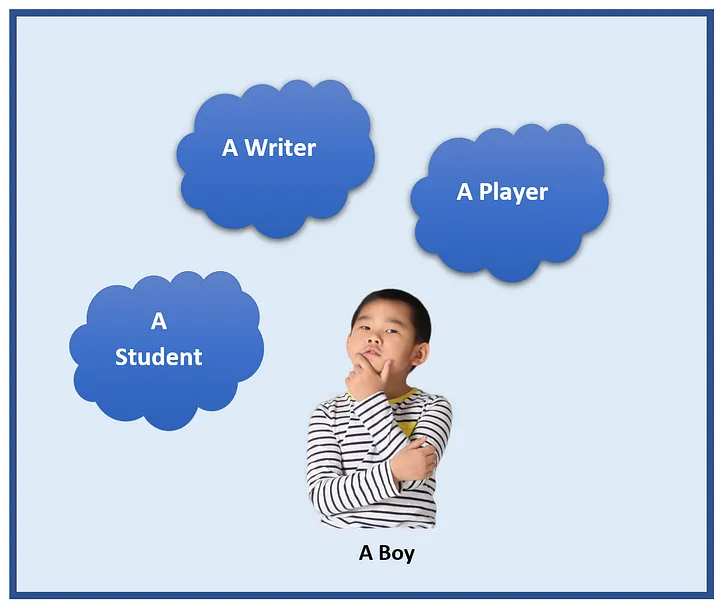
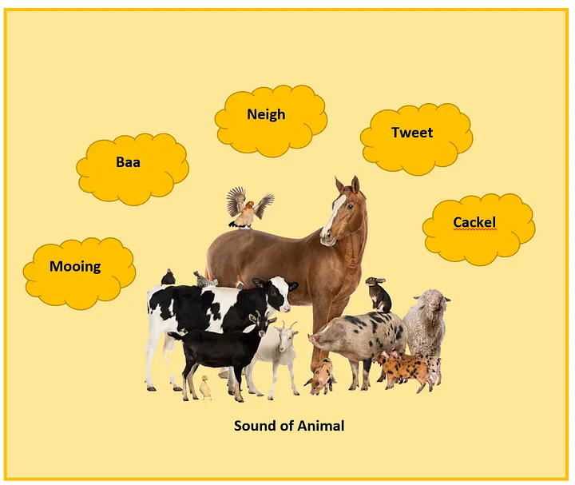
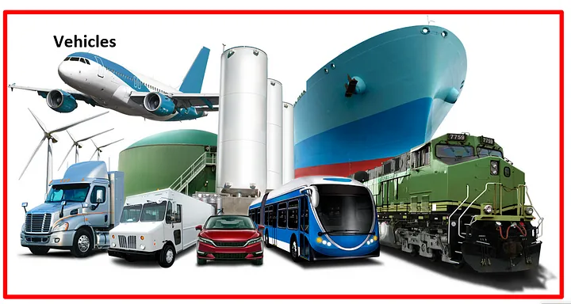
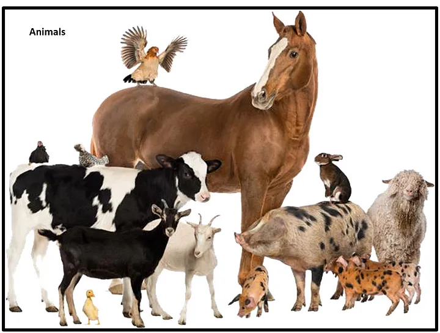

# OOP Concepts with Real-World Examples

This document explains the fundamental concepts of Object-Oriented Programming (OOP) with real-world examples.

## What is OOP?

Object-Oriented Programming (OOP) is a programming paradigm based on objects, which are real-world entities like books, vehicles, trees, etc.

### OOP Concepts

There are four main OOP concepts:

1. **Polymorphism**
2. **Inheritance**
3. [**Trait**](./trait.md)

Each of these concepts is explained below with examples.

---

## 1. Polymorphism

Polymorphism is the ability to exist in many forms.

### Example 1: Boy as a Student, Player, and Writer
We can take a boy as a real-world example. This boy can be a student, a player, and a writer. So that this boy can exist in different ways in different situations.

### Example 2: Animal Sounds
Sound of animals. People have the same sound but different animals make different sounds. The following diagram shows few different sounds make by animals.

This what we called as polymorphism.

## 2. Inheritance

Inheritance allows classes to inherit common properties from a parent class.

### Example 1: Vehicle Class
let's assume that there is a class as `Vehicle`. All vehicles are not the same. We can inherit common properties like color, size, type from the parent `vehicle` class and create classes like `Car`, `Bus`, `Bike`.

### Example 2: Animal Class
let's take another parent class as `Animals`. Here also we can inherit common properties like `name`, `sound`, `color`, `breed` from `Animal` class and create classes like `Dog`, `Cat`, `Horse` and etc.

## Class Recordings
You can find the class recording by following the URL
[Youtube Link](https://youtu.be/3Ez4J7gzSh8)
