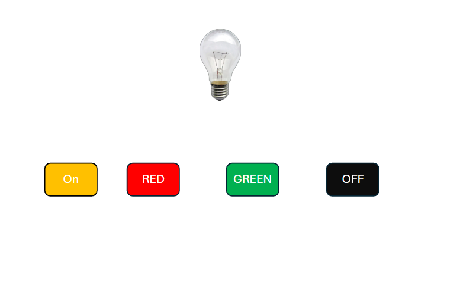

# JavaScript

## Topics
* How to run JS code?
    - Browser Console
    - Externel JS
    - Internel JS
* How to present something infornt of user?

    - console (Console)
    - document (Document)
    - alert

* `var` vs `let`

* String Manipulation
* Loop
* Arrow Function
* DOM
    - Selector
    - Event Listening

## Assignment

* Solve code duplication problem
* Develop Ligh On/Off Project

## Class Recording
You can find the class recording by following the URL
[Youtube Link](https://youtu.be/WPhynOMtI4w)
