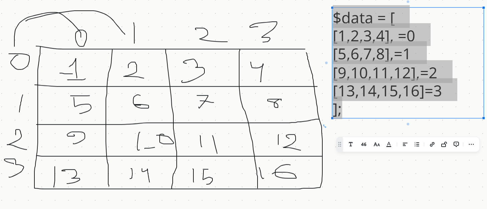

# PHP Loops
Often when you write code, you want the same block of code to run over and over again a certain number of times. So, instead of adding several almost equal code-lines in a script, we can use loops.

Loops are used to execute the same block of code again and again, as long as a certain condition is true.

## In PHP, we have the following loop types:

* while - loops through a block of code as long as the specified condition is true
* do...while - loops through a block of code once, and then repeats the loop as long as the specified condition is true
* for - loops through a block of code a specified number of times
* foreach - loops through a block of code for each element in an array

# Iterate Over 2D array

# Class Recordings
You can find the class recording by following the URL
[Youtube Link](https://youtu.be/MMhRhL_92Bo)

# Assignment
You have to submit this assignment by 23rd May of 2024
- Find the all of odd number from 1-100.
- Factorial number
- Fibonacci series
- Find the summation of diagonal numbers of the rectangle tables
- Find the summation of only 4 sides numbers of the rectangle tables.
- **Pattern:** Left Half & Full Pyramid, 

